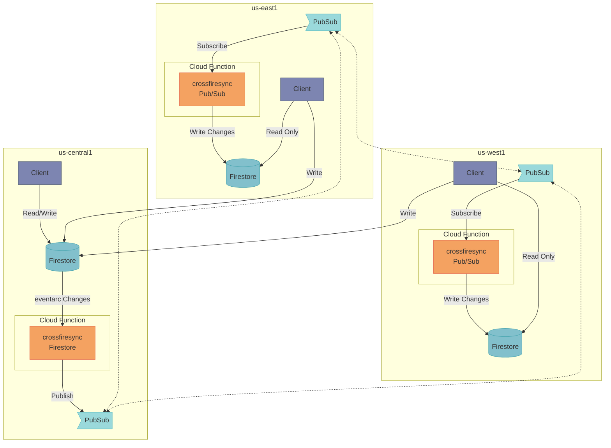
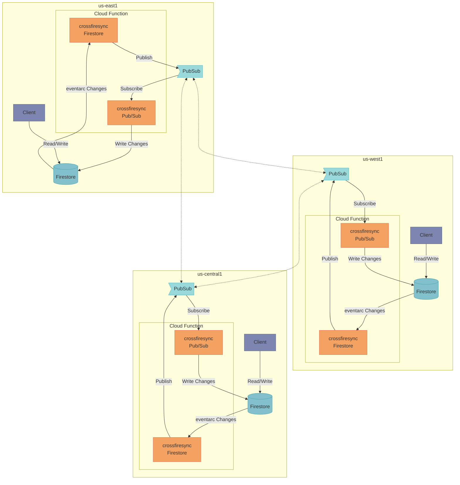

[](https://opensource.org/licenses/Apache-2.0) [](https://central.sonatype.com/artifact/com.unitvectory/crossfiresync) [](https://javadoc.io/doc/com.unitvectory/crossfiresync) [](https://codecov.io/gh/UnitVectorY-Labs/crossfiresync)

# crossfiresync

Real-time synchronization between GCP Firestore instances across regions using PubSub.

## Getting Started

This library requires Java 17 and is available in the Maven Central Repository:

```xml
<dependency>
    <groupId>com.unitvectory</groupId>
    <artifactId>crossfiresync</artifactId>
    <version>0.0.1</version>
</dependency>
```

The default configuration for the application uses environment variables to set the necessary configuration. They are as follows:

- **REPLICATION_MODE**: The type of replication either `SINGLE_REGION_PRIMARY` or `MULTI_REGION_PRIMARY`
- **DATABASE**: The Firestore database name; must be in the matching region
- **GOOGLE_CLOUD_PROJECT**: The GCP project name
- **TOPIC**: The PubSub topic name; must be a multi-region topic

The following example applications are provided with scripts to deploy the corresponding Cloud Functions to make setting up replication easy:
- [crossfiresync-firestore](https://github.com/UnitVectorY-Labs/crossfiresync-firestore)
- [crossfiresync-pubsub](https://github.com/UnitVectorY-Labs/crossfiresync-pubsub)

## Synchronization Mechanism

To replicate the data in a Firestore collection between different regions a Cloud Function, the `FirestoreChangePublisher`, is triggered by `google.cloud.firestore.document.v1.written` so it receives all inserts, updates, and events for the documents.  These changes are written to a Pub/Sub topic.  Another Cloud Function, the `PubSubChangeConsumer` is triggered by the Pub/Sub topic.  These Cloud Functions are configured in each region that the it is desired to have the data replicate between.

The aspiration of this application is to allow for full read and write access to the Firestore collections in each region having them replicated and consistent in all of the regions where replication is enabled.  However, the limitations of how Firestore and Pub/Sub work make it so that it is impossible to guarentee consistency between all of the region.

### Single Region Primary

**Replication Mode:** `SINGLE_REGION_PRIMARY`

In single region primary mode all writes must be directed to the primary region.  Synchornization of all document changes can then be replicated to other regions.



When using a single region primary the `FirestoreChangePublisher` function is deployed only to the primary region where all of the writes are directed and the `PubSubChangeConsumer` function is deployed to all of the regions where data is to be replicated.  It is critical that this configuration is used when in this mode to avoid replication loops.

The benefit of single region primary mode is additional attributes do not need to be added to the documents.  The downside being that all writes must be directed to a single region.

### Multi Region primary

**Replication Mode:** `MULTI_REGION_PRIMARY`

In multi region primary mode writes can be directed to any region.  Synchronization of the various documents is attempted to be kept in sync, but the guarentees provided by Firestore, Cloud Functions, and Pub/Sub working together cannot guarentee the copy of the database in each region is perfectly in sync.



When using multi region primary the `FirestoreChangePublisher` and `PubSubChangeConsumer` are deployed to every region.  It is critical both are deployed in every region when in this mode for replication to function correctly.

In order to efficiently accomplish the replication with writes in multiple regions some additional attributes must be added to the document, this is the primay downside of this mode.  These fields help control the replication of data between the regions.  An application using the documents **must not** write these attributes as that can adversely impacting data consistency.  An application using the documents **should not** delete these attributes, but doing so will not impact replication as that is treated as a modification to the document resulting in the data being replicated.

The attributes that are added are:

- `crossfiresync:timestamp`
- `crossfiresync:sourcedatabase`
- `crossfiresync:delete`

The main benefit of multi region primary is that writes can be directed to any region and will be synchronized to the other regions.  However, because of the limitations it may be desirable to direct edits for individual or groups of documents to be directed to the same region through means applicable to the specific use case as the last edit to a document wins and data can be lost if conflicting edits are made in separate regions.
